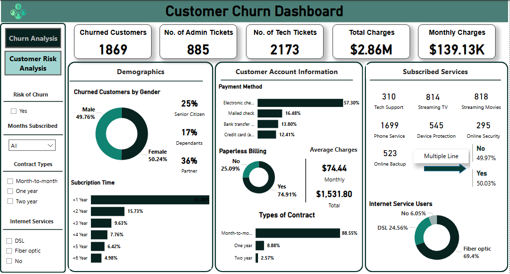
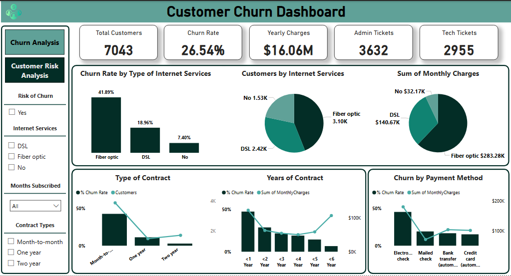

# **Customer Churn Analysis**

 ## Table of contents
- [Project Overview](#project-overview)

  - [Objective](#objective)

- [About the Data](#about-the-data) 

- [Data Preparation](#data-preparation)

- [Insights](#insights)

- [Recommendations](#recommendations)

- [Conclusion](#conclusion)
   

## Project Overview

What is Customer Churn? Customer churn is essentially the rate at which customers stop doing business with a company or service. This is also known as churn rate or customer attrition.

### Objective

The objective of this analysis is to discover various factors contributing to the increased customer churn rate at Telecommunication industry, by creating an interactive dashboard that provides the business users with insights which they can use to make informed decisions and strategize on how to improve customer retention and reduce the churn rate.

## About the Data

The dataset is a Microsoft Excel file containing a single table with 7,043 rows and 23 columns of telecommunication customer information. It includes customer demographics, service usage, contract types, billing patterns, and support metrics. The data was obtained from Forage.

## Data Preparation

 The data transformation was carried out using Power Query, after which the cleaned data was loaded into Microsoft Power BI Desktop for modeling and analysis. The key steps undertaken in this project are as follows:

1. **Data Inspection:** Performed an initial review of the dataset to identify and assess missing values, inconsistencies, and potential data quality issues.

2. **Data Transformation:** Cleaned and organized the dataset using Power Query to ensure it was analysis-ready, including handling null values, correcting data types, and removing duplicates.

3. **Data Modeling:** 
Created calculated columns and measure to support analysis.

4. **Data Analysis (DAX):** Utilized DAX (Data Analysis Expressions) to create measures and KPIs, enabling deeper insights into customer behavior and churn patterns.

5. **Data Visualization (Dashboard):** 
Developed interactive and visually engaging dashboards to present complex insights in a clear, intuitive, and actionable format.

## Insights

1. **Overview:**

- Total customers are 7,043 with number of retained customers is 5174 & customers churned are 1,869.

- The rate of retained customers is 73.46% & the rate of churned customers is 26.54%, amounting to $16.06M yearly charges and $456.12K monthly charges.

- Total charges (Revenue) for churn customers is $2.86M.
- 885 admin tickets and 2,173 tech tickets (Churned) were opened.

2. **Demographics**

- Gender Distribution among churned customers is nearly balanced: Female (50.24%), Male (49.76%).

- Senior Citizens represent 25% of churned customers, 17% are dependents, and 36% are partners - suggesting different value perceptions or usage behaviors based on household roles.

3. **Subscription Duration**

- Over 55% of churned customers left within 1 year, signaling weak early-stage retention.

- Less than 5% churned after 5 years, implying increased loyalty over time.

4. **Account Information**

- Most churned customers used Electronic Check (57.3%), which also had the highest churn rate (45.29%).

- Paperless Billing customers churned more (74.91%)

5. **Internet Services & Churn Behavior**

- Fiber Optic Internet users exhibit the highest churn rate at 41.89%, the highest among all types.

- Despite high churn, fiber optic contributes the largest share of monthly revenue ($283.28K).

- High-value fiber optic users are leaving at an alarming rate and require targeted retention efforts.

6. **Contract Type**

- 88.55% of churned users were on month-to-month contracts and are more likely to churn, customers on longer contracts (1-year: 8.8%, 2-year: 2.57%) show significantly lower churn. 

- Long-term contracts reduce churn by increasing customer commitment

- Customers on longer-term contracts are significantly more loyal. Encouraging these plans could dramatically reduce churn.

7. **Years of Contract (Customer Tenure)**

- Customers in their first year churn the most (47.44%).

- Churn decreases with tenure: 1–2 years: 28.71%, 2–3 years: 21.03%, >3 years: 13.42%

- Focus on on-boarding, support, and early satisfaction during the first 12 months is critical for improving retention.

8. **Payment Method Correlation**

- Electronic Check has the highest churn at 45.29%, followed by mailed check: 19.11%, bank transfer and credit card having lower churn at 16.17% and 14.24% respectively.

- Customers using automatic payment methods (bank transfer and credit card) are less likely to churn. Promoting auto-pay options could enhance loyalty.

## Recommendations

1. **Improve Early Customer Experience**

- Focus on the first year—offer on-boarding assistance, value education, and welcome perks.

- Conduct satisfaction surveys after the first 90 days.

2. **Promote Long-Term Contracts**

- Encourage 1- and 2-year contracts through discounts or added service bundles.

- Highlight cost savings and exclusive benefits for long-term subscribers.

3. **Review Fiber Optic Service Experience**

- Investigate complaints and technical issues linked to fiber optic users.

- Improve service reliability and provide proactive technical support.

4. **Rethink Electronic Billing Strategy**

- Re-evaluate the user experience for electronic check and paperless billing customers.

- Ensure billing clarity, transparency, and proactive payment reminders.

5. **Enhance Customer Support**

- Reduce ticket backlog; track churn vs. unresolved tickets.

- Implement follow-up systems after support interactions to gauge satisfaction.

## Conclusion
The churn rate of 26.54% is significant, especially among short-tenure and fiber optic users. Month-to-month contracts and electronic billing users show higher churn tendencies. Early customer retention, improved service satisfaction, and better support engagement are key to reducing churn.

[ <a href="#table-of-contents">↑ Back to top ↑</a> ]

